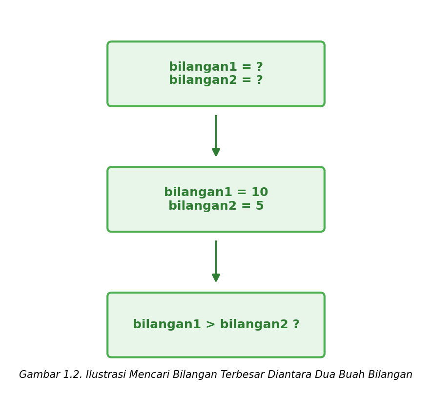
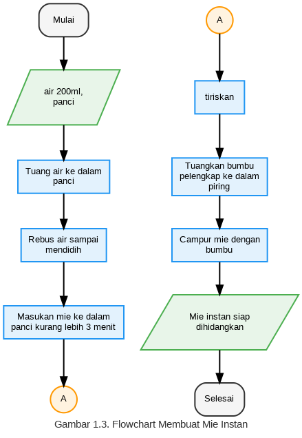
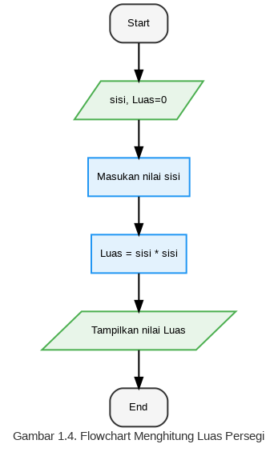
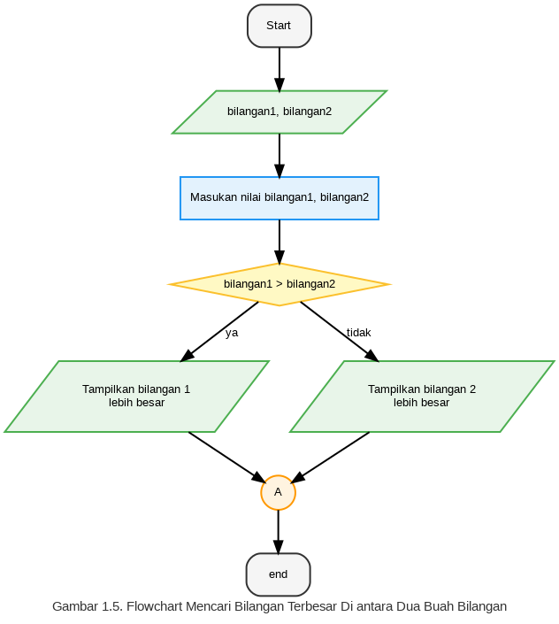
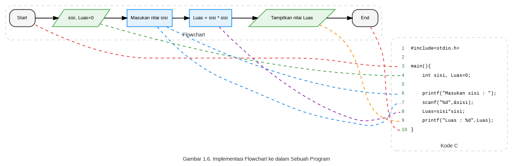
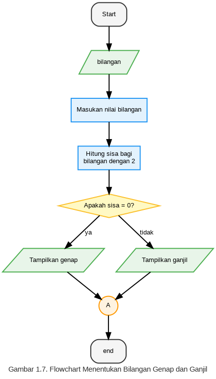

# Bab 1: Algoritma dan Pemrograman

## 1.1 ALGORITMA
Algoritma adalah langkah-langkah penyelesaian masalah dalam bentuk kalimat yang disusun secara sistematis dan logis [1]. Suatu algoritma harus efektif dan jelas, didefinisikan secara tepat, memiliki input atau kondisi awal dan output atau kondisi akhir. Algoritma nantinya akan diterjemahkan ke dalam bahasa pemrograman [2].

Algoritma sering ditemui dalam kehidupan sehari-hari. Dalam merencanakan suatu kegiatan yang akan kita lakukan, tanpa sadar kita merencanakan bagaimana proses pekerjaan tersebut akan dilaksanakan. Apabila langkah-langkah penyelesaian masalah tersebut tidak logis maka tidak akan dihasilkan hasil yang diharapkan. Misalnya ketika kita memasak namun resep yang kita jadikan acuan langkah-langkahnya tidak logis maka tidak akan menghasilkan masakan yang kita inginkan. Berikut diberikan contoh-contoh algoritma.

### a. Contoh: Algoritma membuat mie instan goreng
**Langkah-langkah:**
* Siapkan air 200ml dan panci untuk memasak.
* Tuang air ke dalam panci.
* Rebus air sampai mendidih.
* Masukan mie ke dalam panci kurang lebih 3 menit kemudian tiriskan.
* Tuangkan bumbu dan bumbu pelengkap ke dalam piring.
* Campur mie yang sudah ditiriskan ke dalam bumbu, aduk rata.
* Mie instan siap dihidangkan.

---

### b. Contoh: Algoritma menghitung luas persegi
**Langkah-langkah:**
* Masukan nilai sisi persegi dan tampung nilainya ke dalam variabel `sisi`.
* Hitung luas persegi dengan rumus $Luas = sisi \times sisi$.
* Tampilkan nilai `Luas` (hasil perhitungan luas).

---

### c. Contoh: Algoritma mencari bilangan terbesar di antara dua buah bilangan
**Langkah-langkah:**
* Definisikan dua buah variabel, yaitu `bilangan1` dan `bilangan2`.
* Beri nilai dari `bilangan1` dan `bilangan2`.
* Bandingkan apakah nilai `bilangan1` lebih besar daripada `bilangan2`.
* Apabila `bilangan1` lebih besar daripada `bilangan2` maka tampilkan `bilangan1` terbesar.
* Jika tidak maka tampilkan `bilangan2` terbesar.

---

Agar dapat dijalankan oleh komputer, algoritma harus diterjemahkan ke dalam bahasa pemrograman yang disebut dengan program. Langkah dalam proses pembuatan program adalah membuat algoritma dan mendesain flowchart, menulis program, menguji program, dokumentasi dan arsip [3].

## 1.2 FLOWCHART
Flowchart adalah suatu bagan yang didalamnya terdapat urutan proses yang digambarkan dalam simbol-simbol, meliputi hubungan antar proses satu dan lainnya. Tabel 1.1 berikut adalah simbol-simbol yang ada pada flowchart.

### Tabel 1.1. Simbol-simbol pada Flowchart

| Simbol | Nama | Fungsi |
| :---: | :---: | :--- |
|  | **Terminator** | Permulaan / akhir program |
|  | **Proses** | Proses perhitungan / proses pengolahan data |
|  | **Predefined-Process** | Permulaan sub program / proses menjalankan sub program |
|  | **Input/output** | Menerima input atau menampilkan output |
|  | **Decision** | Menyediakan pilihan aliran berdasar syarat tertentu |
|  | **Predefined Data** | Definisi awal dari variabel atau data |
|  | **On page connector** | Penghubung bagian flowchart yang masih dalam satu halaman |
|  | **Off page connector** | Penghubung bagian flowchart yang berada pada halaman berbeda |
|  | **Flow Line (connector)** | Menghubungkan simbol satu dengan simbol lainnya |

---

### Contoh: Flowchart membuat mie instan
Gambar 1.3 adalah contoh flowchart membuat mie instan goreng, Gambar 1.4 adalah contoh flowchart menghitung luas persegi, sedangkan Gambar 1.5 adalah flowchart mencari bilangan terbesar di antara dua buah bilangan.

---

---

---

Pada Gambar 1.6 merupakan implementasi flowchart ke dalam sebuah program. Nantinya flowchart atau algoritma akan diimplementasikan ke dalam program yang akan dijalankan oleh komputer untuk melakukan tugas tertentu.

---

## A. CONTOH SOAL
### 1. Buatlah algoritma dan flowchart untuk menentukan apakah suatu bilangan adalah ganjil atau genap!

**Jawaban (Algoritma):**
* Input bilangan.
* Hitung sisa bagi bilangan dengan 2 ($sisabagi = bilangan \% 2$).
* Apakah sisa bagi adalah 0?
    * Jika iya, maka tampilkan bilangan **genap**.
    * Jika tidak, maka tampilkan bilangan **ganjil**.

---

## B. TUGAS
1. Buatlah algoritma dan flowchart salah satu kegiatan Anda sehari-hari menggunakan simbol-simbol yang bervariasi!
2. Buatlah algoritma dan flowchart menghitung luas lingkaran!
3. Buatlah algoritma dan flowchart untuk menghitung volume kerucut!
4. Buatlah algoritma dan flowchart untuk menghitung keliling lingkaran!
