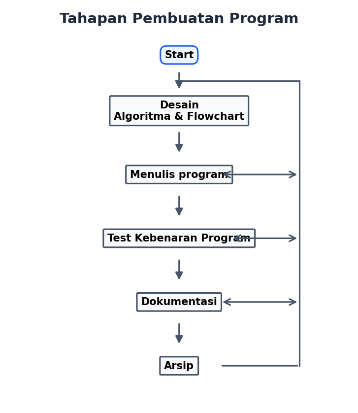
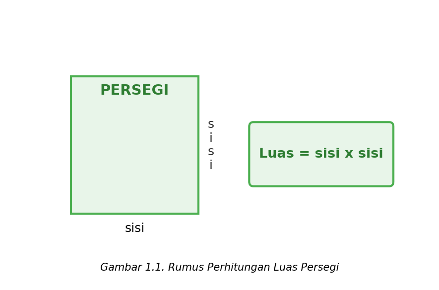
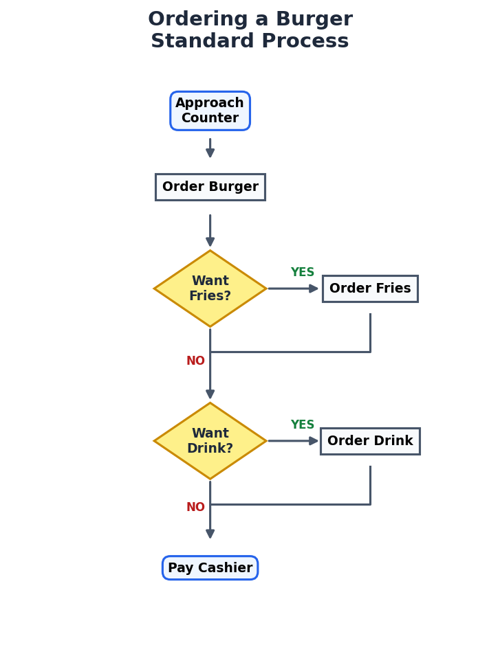
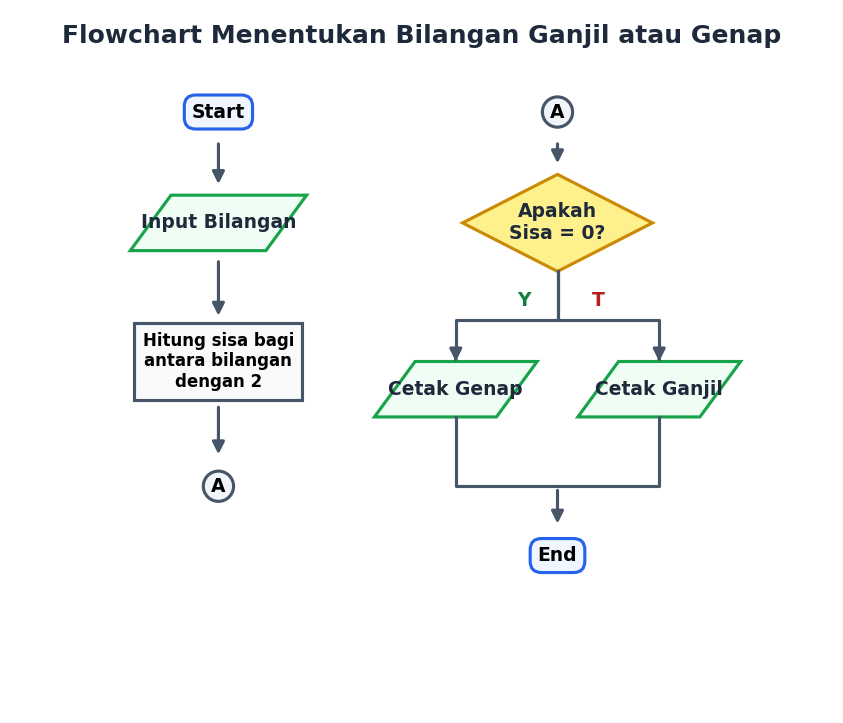
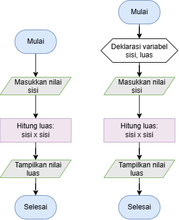

# Bab 2: Algoritma dan Flowchart

## 2.1 TUJUAN PEMBELAJARAN (OBJECTIVES)
Setelah mempelajari bab ini, Anda diharapkan dapat:
* Mengerti tentang konsep dasar **Algoritma**.
* Membuat rancangan algoritma untuk memecahkan suatu permasalahan.
* Mengerti tentang konsep dasar bagan alir (**Flowchart**).
* Membuat bagan alir (*flowchart*) untuk memecahkan suatu permasalahan.

---

## 2.2 TAHAPAN PEMBUATAN PROGRAM
Dalam membangun sebuah perangkat lunak atau program komputer, terdapat tahapan terstruktur yang harus dilalui agar program yang dihasilkan terencana dengan baik:

1. **Mendefinisikan Masalah dan Menganalisisnya**
   Mencakup penentuan tujuan pembuatan program, parameter input/output yang digunakan, fasilitas yang disediakan oleh bahasa pemrograman, pemilihan algoritma yang tepat, serta bahasa pemrograman yang akan digunakan.
   
2. **Merealisasikan Program (Tahap Implementasi)**
   Langkah-langkah sistematis dari perencanaan hingga pemeliharaan program digambarkan pada bagan alir berikut:

---

## 2.3 ALGORITMA
Algoritma adalah **inti dari ilmu komputer**. Secara definisi, algoritma merupakan urutan-urutan instruksi atau langkah-langkah logis yang disusun secara sistematis untuk menyelesaikan suatu masalah tertentu. Algoritma berfungsi sebagai **blueprint** dari sebuah program komputer dan sebaiknya disusun secara matang sebelum proses penulisan kode (*coding*) dimulai.

### Kriteria Suatu Algoritma:
* **Ada Input dan Output**: Memiliki nilai masukan (kondisi awal) dan menghasilkan nilai keluaran (kondisi akhir/solusi).
* **Efektivitas dan Efisien**: Langkah-langkah instruksi harus dapat dieksekusi secara cepat dan tepat waktu.
* **Terstruktur**: Disusun secara berurutan dan logis tanpa ambiguitas.

### Contoh Algoritma dalam Pembelajaran:

#### **Contoh 1: Mengirim surat kepada teman**
1. Tulis surat pada secarik kertas surat.
2. Ambil sampul surat.
3. Masukkan surat ke dalam sampul.
4. Tutup sampul surat menggunakan perekat.
5. Jika kita ingat alamat teman tersebut, maka tulis alamat pada sampul surat.
6. Jika tidak ingat, lihat buku alamat, kemudian tulis alamat pada sampul surat.
7. Tempel perangko pada surat.
8. Bawa surat ke kantor pos untuk diposkan.

#### **Contoh 2: Algoritma menghitung luas persegi**
1. Masukan nilai sisi persegi dan tampung nilainya ke dalam variabel `sisi`.
2. Hitung luas persegi dengan rumus $Luas = sisi \times sisi$.
3. Tampilkan nilai `Luas` (hasil perhitungan luas).
   

#### **Contoh 3: Menentukan apakah suatu bilangan bulat merupakan bilangan ganjil atau genap**
1. Masukkan sebuah bilangan sembarang.
2. Bagi bilangan tersebut dengan bilangan $2$.
3. Hitung sisa hasil bagi pada langkah 2.
4. Bila sisa hasil bagi sama dengan $0$ maka bilangan itu adalah bilangan genap, tetapi bila sisa hasil bagi sama dengan $1$ maka bilangan itu adalah bilangan ganjil.

---

## 2.4 FLOWCHART (BAGAN ALIR)
Flowchart adalah **bagan-bagan yang mempunyai arus** yang menggambarkan langkah-langkah penyelesaian suatu masalah secara visual. Flowchart merupakan representasi grafis dari suatu algoritma.

Terdapat 2 jenis Flowchart:
1. **System Flowchart**: Menggambarkan urutan proses di dalam sistem secara makro dengan menunjukkan media input, output, serta media penyimpanan data yang digunakan dalam proses pengolahan data.
2. **Program Flowchart**: Menggambarkan urutan instruksi secara mikro dengan menggunakan simbol-simbol standar tertentu untuk memecahkan masalah di dalam suatu program.

---

### Simbol-simbol Standar Flowchart
Berikut adalah tabel simbol flowchart standar beserta nama dan fungsinya:

| Simbol | Nama Simbol | Fungsi |
| :---: | :--- | :--- |
|  | **TERMINATOR** | Permulaan atau akhir dari suatu program. |
|  | **GARIS ALIR (FLOW LINE)** | Menunjukkan arah aliran jalannya program. |
|  | **PREPARATION** | Proses inisialisasi atau pemberian nilai/harga awal bagi variabel. |
|  | **PROSES** | Menunjukkan proses perhitungan atau pengolahan data. |
|  | **INPUT/OUTPUT DATA** | Menerima masukan (*input*) data atau menampilkan keluaran (*output*) informasi. |
|  | **PREDEFINED PROCESS (SUB PROGRAM)** | Permulaan sub program atau proses untuk menjalankan sub program/prosedur. |
|  | **DECISION** | Menyediakan pilihan aliran/perbandingan pernyataan untuk langkah selanjutnya. |
|  | **ON PAGE CONNECTOR** | Penghubung bagian-bagian flowchart yang berada pada halaman yang sama. |
|  | **OFF PAGE CONNECTOR** | Penghubung bagian-bagian flowchart yang berada pada halaman berbeda. |

---

### Kaidah dan Panduan Pembuatan Flowchart:
* **Tidak Ada Aturan Baku**: Flowchart adalah gambaran visual hasil analisis masalah, sehingga bentuknya bisa bervariasi antar pemrogram.
* **3 Bagian Utama**: Secara garis besar, flowchart harus memiliki bagian **Input**, **Proses**, dan **Output**.
* **Efisiensi Aliran**: Hindari pengulangan proses yang tidak perlu serta logika yang berbelit-belit agar jalannya proses menjadi lebih singkat dan jelas.
* **Arah Aliran**: Jalannya proses digambarkan dari atas ke bawah dan dari kiri ke kanan, diperjelas dengan tanda panah (*flow line*).
* **Titik Awal & Akhir**: Sebuah flowchart wajib diawali oleh satu titik **START** dan diakhiri oleh titik **END**.

---

## 2.5 CONTOH FLOWCHART

### 1. Contoh Flowchart Pembelian Burger (Standard Process)
Bagan alir di bawah ini merepresentasikan algoritma memesan burger di konter makanan cepat saji, disertai opsi tambahan berupa pemesanan kentang (*fries*) dan minuman (*drink*):

---

### 2. Contoh Flowchart Menentukan Bilangan Ganjil atau Genap
Bagan alir ini menggambarkan algoritma untuk menentukan apakah suatu bilangan sembarang termasuk dalam kategori ganjil atau genap dengan menggunakan simbol *On-Page Connector* (A):

---

### 2. Contoh Flowchart Luas Persegi
Bagan alir ini menggambarkan algoritma untuk menentukan luas persegi dari perkalian nilai tiap sisi:

---

Pada Gambar 1.6 merupakan implementasi flowchart ke dalam sebuah program. Nantinya flowchart atau algoritma akan diimplementasikan ke dalam program yang akan dijalankan oleh komputer untuk melakukan tugas tertentu.

---

## 2.6 LATIHAN SOAL MANDIRI
Cobalah membuat algoritma dan flowchart untuk permasalahan di bawah ini berdasarkan materi yang telah dipelajari:

1. Buatlah algoritma untuk menghitung **luas dan keliling lingkaran** dengan masukan (*input*) berupa jari-jari!
2. Buatlah bagan alir (*flowchart*) dari algoritma menghitung luas dan keliling lingkaran tersebut!
3. Buatlah algoritma untuk mengecek bilangan di antara 2 bilangan masukan, apakah nilainya sama ataukah salah satunya lebih besar, lalu tampilkan hasilnya!
4. Buatlah bagan alir (*flowchart*) dari algoritma perbandingan 2 bilangan tersebut!
